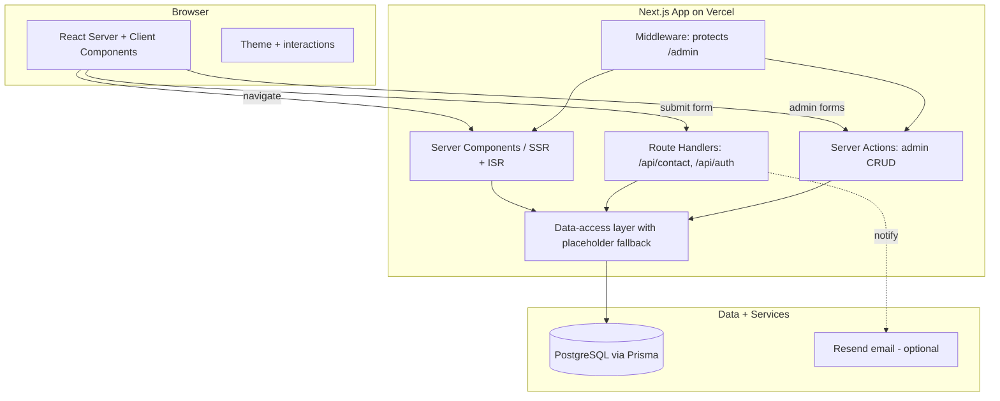
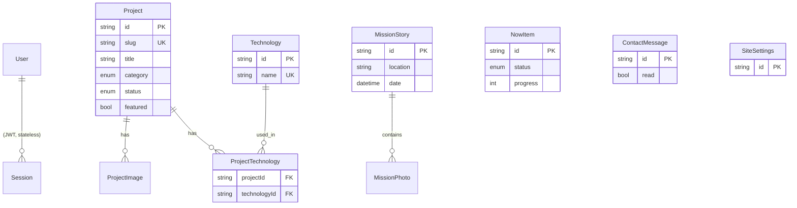

# Personal Portfolio — Full-Stack Web Application

A production-quality personal portfolio built as a real full-stack application, not a static resume page. It showcases projects, a resume, mission stories, and a "currently working on" feed — all editable through a secure admin dashboard backed by PostgreSQL.

> "I designed, developed, and deployed this full-stack personal portfolio application."

**Design language:** Bold / Neo-Brutalist — thick borders, hard offset shadows, chunky grotesque type, loud primary accents, and snappy, tactile interactions. Fully responsive, accessible, and available in light and dark themes.

---

## Table of Contents

- [Why I built this](#why-i-built-this)
- [Features](#features)
- [Tech stack](#tech-stack)
- [Architecture](#architecture)
- [Database design](#database-design)
- [Backend / API](#backend--api)
- [Authentication](#authentication)
- [Local development](#local-development)
- [Environment variables](#environment-variables)
- [Deployment (Vercel + Neon)](#deployment-vercel--neon)
- [Testing](#testing)
- [Project structure](#project-structure)
- [Customizing the content](#customizing-the-content)
- [Security](#security)
- [Future improvements](#future-improvements)

---

## Why I built this

I wanted a portfolio that *demonstrates* full-stack ability rather than just claiming it. Every page is server-rendered from a real data layer, the contact form persists to a database through a validated API, and the content is managed through a protected admin dashboard with CRUD operations. The technical sophistication sits underneath a polished, personal experience.

It also had to be practical: it works immediately after `git clone` (falling back to bundled placeholder content), and becomes fully dynamic the moment a database is connected.

## Features

- **Home** — hero, featured projects, skills marquee, "now" and mission teasers, contact CTA
- **About** — personal narrative, interests, goals, and mission context
- **Resume** — structured experience/education/skills with a downloadable PDF and print support
- **Mission** — storytelling timeline, responsive masonry gallery, and a keyboard-accessible lightbox
- **Projects** — filterable grid with category chips and polished cards
- **Project detail** — full case studies (`/projects/[slug]`) with problem, solution, architecture, challenges, and learnings
- **Now** — "currently working on" feed with status and progress indicators
- **Contact** — functional form with client + server validation, rate limiting, DB persistence, and optional email notifications
- **Admin dashboard** (`/admin`) — secure CRUD for projects, now items, mission stories, resume data, site settings, and contact messages
- **Dark / light mode** — system-aware, persisted, accessible toggle
- **SEO** — per-page metadata, Open Graph + Twitter cards, dynamic OG image, JSON-LD `Person` schema, sitemap, and robots
- **Accessibility** — semantic HTML, focus states, skip link, keyboard navigation, reduced-motion support
- **Tests** — Vitest + Testing Library covering validation, components, and the contact API

## Tech stack

| Layer        | Technology                                             |
| ------------ | ------------------------------------------------------ |
| Framework    | Next.js 15 (App Router), React 19                      |
| Language     | TypeScript (strict)                                    |
| Styling      | Tailwind CSS v4 + a small neo-brutalist design system  |
| Database     | PostgreSQL                                             |
| ORM          | Prisma                                                 |
| Auth         | Auth.js (NextAuth v5), Credentials + JWT sessions      |
| Validation   | Zod (shared client/server)                             |
| Forms        | React Hook Form                                        |
| Animation    | Framer Motion                                          |
| Email (opt.) | Resend (via REST, env-gated)                           |
| Testing      | Vitest, React Testing Library                          |
| Hosting      | Vercel + Neon (serverless Postgres)                    |

## Architecture



**Key design decisions**

- **Data-access layer with graceful fallback** (`src/lib/content.ts`): every reader tries Prisma first and falls back to bundled placeholder content if the DB is unreachable or empty. The site is never broken, and it upgrades to fully dynamic once seeded.
- **Route groups**: public pages live in `(site)` with the shared navbar/footer; `/admin` and `/login` have their own chrome.
- **Server Actions for writes**: admin CRUD uses type-safe server actions guarded by an auth check, with Zod validation and `revalidatePath` cache invalidation.
- **Edge-safe auth split**: `auth.config.ts` (no DB) runs in middleware; `auth.ts` adds the Credentials provider for the Node runtime.

## Database design



Models: `User`, `Project`, `Technology`, `ProjectTechnology` (join), `ProjectImage`, `NowItem`, `MissionStory`, `MissionPhoto`, `Experience`, `Education`, `ResumeSkill`, `ContactMessage`, `SiteSettings`. All use timestamps, appropriate indexes, and cascading relations. See [`prisma/schema.prisma`](prisma/schema.prisma).

## Backend / API

- **Public reads** are performed in Server Components via the data-access layer (SSR/ISR).
- **`POST /api/contact`** — Zod-validated, IP rate-limited (5 / 10 min), persists a `ContactMessage`, and fires an optional email notification. Returns structured field errors.
- **`/api/auth/[...nextauth]`** — Auth.js handlers.
- **Admin writes** — Server Actions in `src/lib/actions/*` for full CRUD, each calling `requireAdmin()`.

## Authentication

Single-admin authentication with Auth.js Credentials provider:

- Passwords are hashed with bcrypt and stored on the `User` model (seeded from env).
- Sessions are JWTs in secure, httpOnly cookies.
- `middleware.ts` protects every `/admin/**` route; server actions re-check the session on the server.

## Local development

Prerequisites: **Node 18+** and a **PostgreSQL** database (local Docker or a free Neon instance).

```bash
# 1. Install dependencies
npm install

# 2. Configure environment variables
cp .env.example .env
#    then edit .env — at minimum set DATABASE_URL, DIRECT_URL, AUTH_SECRET,
#    ADMIN_EMAIL, ADMIN_PASSWORD. Generate a secret with: openssl rand -base64 32

# 3. Create the database schema (runs the first migration)
npm run prisma:migrate

# 4. Seed placeholder content + the admin user
npm run db:seed

# 5. Run the dev server
npm run dev            # http://localhost:3000
```

> No database yet? You can still run `npm run dev` — the site renders bundled placeholder content. The admin dashboard requires a database.

Other useful scripts:

```bash
npm run build          # production build (prisma generate + next build)
npm run start          # run the production build
npm run lint           # eslint
npm run typecheck      # tsc --noEmit
npm test               # run the test suite
npm run db:studio      # open Prisma Studio
```

Sign in to the dashboard at `/login` using `ADMIN_EMAIL` / `ADMIN_PASSWORD`.

## Environment variables

| Variable                     | Required | Description                                              |
| ---------------------------- | -------- | -------------------------------------------------------- |
| `DATABASE_URL`               | yes      | Pooled Postgres connection string (app runtime)          |
| `DIRECT_URL`                 | yes      | Direct Postgres connection (used by Prisma Migrate)      |
| `AUTH_SECRET`                | yes      | Secret for signing JWT sessions (`openssl rand -base64 32`) |
| `AUTH_URL` / `AUTH_TRUST_HOST` | prod   | Deployment URL / trust host flag                         |
| `ADMIN_EMAIL`                | yes      | Seeded admin login email                                 |
| `ADMIN_PASSWORD`             | yes      | Seeded admin password                                    |
| `ADMIN_NAME`                 | no       | Seeded admin display name                                |
| `NEXT_PUBLIC_SITE_URL`       | yes      | Public base URL (SEO, sitemap, OG)                       |
| `RESEND_API_KEY`             | no       | Enables contact email notifications                      |
| `CONTACT_NOTIFICATION_EMAIL` | no       | Destination for contact notifications                    |

See [`.env.example`](.env.example).

## Deployment (Vercel + Neon)

1. **Create a Postgres database on [Neon](https://neon.tech)** (free tier). Copy both the *pooled* and *direct* connection strings.
2. **Push this repo to GitHub** and import it into [Vercel](https://vercel.com).
3. **Add environment variables** in Vercel Project Settings → Environment Variables (all of the above). Use the Neon pooled URL for `DATABASE_URL` and the direct URL for `DIRECT_URL`. Set `NEXT_PUBLIC_SITE_URL` and `AUTH_URL` to your production domain.
4. **Build command**: this repo ships a `vercel.json` that runs `npm run vercel-build`, which executes `prisma generate && prisma migrate deploy && next build` — so migrations are applied automatically on every deploy.
5. **Seed production (once)**: from your machine, with the production `DATABASE_URL` exported, run `npm run db:seed` to create the admin user and initial content. (Or add a temporary seed step.)
6. **Deploy.** Your site is live; sign in at `/login` and start managing content.

## Testing

```bash
npm test           # run once
npm run test:watch # watch mode
```

Coverage includes:

- **Validation** — every Zod schema (contact, login, project, now item)
- **Components** — Button (link/button/external), Badge, StatusBadge, ProgressBar, TechnologyList
- **API** — `POST /api/contact` happy path, validation errors, and rate limiting (Prisma mocked)

## Project structure

```
prisma/                  Prisma schema + seed
src/
  app/
    (site)/              Public pages (home, about, resume, mission, projects, now, contact)
    admin/               Protected dashboard (overview + CRUD)
    api/                 Route handlers (contact, auth)
    login/               Admin login
    sitemap.ts, robots.ts, manifest.ts, opengraph-image.tsx
  auth.ts, auth.config.ts, middleware.ts
  components/
    ui/                  Design-system primitives (Button, Card, Badge, Input, Modal, ...)
    layout/              Navbar, Footer, ThemeProvider/Toggle
    portfolio/           ProjectCard, Timeline, MissionGallery, ContactForm, ...
    admin/               Sidebar, forms, tables, action buttons
    seo/                 JSON-LD
  lib/
    content.ts           Data-access layer (DB + placeholder fallback)
    actions/             Server Actions (auth, project, now, mission, message, settings, resume)
    data/                Typed placeholder content (edit these!)
    validations.ts       Zod schemas
    prisma.ts, utils.ts, labels.ts, rate-limit.ts, email.ts
  types/                 Shared types
tests/                   Vitest suites
```

## Customizing the content

All placeholder content lives in `src/lib/data/` and is mirrored by `prisma/seed.ts`:

- `site.ts` — name, tagline, bio, socials, About narrative
- `projects.ts` — projects and case studies
- `now.ts` — currently-working-on items
- `mission.ts` — mission stories and photos (placeholders only — no real places/dates)
- `resume.ts` — experience, education, activities
- `skills.ts` — skills and proficiency

Once a database is connected and seeded, prefer editing content through the **admin dashboard**. Replace `public/resume.pdf` with your real resume (or set `resumeUrl` in Settings).

## Security

- Input validated with Zod on both client and server
- Prisma parameterizes all queries (SQL-injection safe); React escapes output (XSS)
- Auth via hashed passwords + signed httpOnly JWT cookies; `/admin` protected by middleware and per-action checks
- Rate limiting on the contact endpoint; honeypot field to deter bots
- Secrets are server-only and never shipped to the client

## Future improvements

- Image uploads (e.g. Cloudinary/UploadThing) in the admin instead of URLs
- Rich-text editing for project case studies
- Redis-backed rate limiting for multi-instance deployments
- Full end-to-end tests (Playwright) and CI on GitHub Actions
- Analytics and a per-project view counter

---

Built with Next.js, TypeScript, Prisma, and PostgreSQL.
